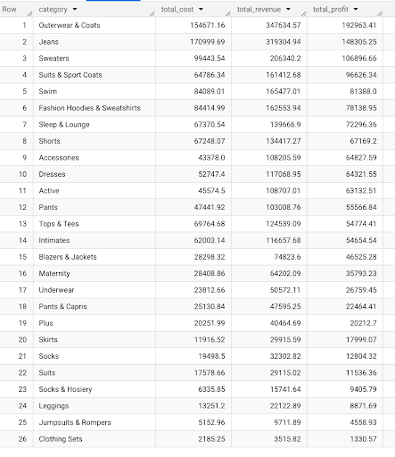
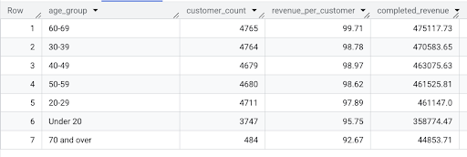
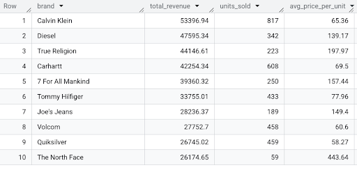
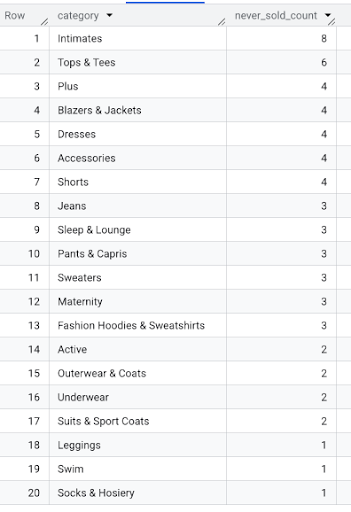

# Analysis Findings Summary

## Q1: Profit by Category

Outerwear & Coats dominates category profits at $193K, with Jeans second at $148.3K.

Revenue and profit are broadly correlated, but several categories break the pattern, showing differences in margin. Accessories profit is greater than four categories above it in total revenue, a sign of strong margins. This pattern repeats across several mid-tier categories.

**Recommendation:** High-margin, lower-revenue categories like Accessories should be evaluated for expanded assortment or promotion. Growing their volume converts disproportionately to profit.

## Q2: Revenue by Customer Age Segment

At first glance, ages 60-69 lead completed revenue at $475.1K, with the entire 30-69 range clustered near the top and separated by less than 3%. Total revenue alone suggests prioritizing older shoppers.

However, looking at revenue per customer across the full 20-69 range, per-customer value is essentially flat at ~$98 to $100 per customer, a spread of under 2%. The differences in total revenue between prime-age buckets are driven by marginal differences in customer count (all near 4.7K), not by differences in customer value. No prime-age segment is meaningfully more valuable per person than another.

Real separation lives near the bottom. Under-20 customers are both slightly lower value ($95.75) and fewer in number (3.7K), while the 70-and-over group is the smallest segment by far (484 customers) at the lowest per-customer value ($92.67).

**Recommendation:** Age is not a useful lever for value-based segmentation here. A merchandising or targeting strategy built on a specific prime-age bracket chases noise rather than signal. Notably, this analysis measures how much each customer is worth, not what they buy. Age may still differentiate category preference, which a separate query would need to test.

## Q3: Top Brands by Revenue

Calvin Klein produced the largest total completed revenue at $53.4K, with Diesel close behind at $47.6K, and True Religion in third at $44.15K. Calvin Klein had a total of 817 sales, significantly larger than all other brands in the top ten, showing its sales model built off higher volume. The North Face cracked the top ten of 2,756 brands on just 59 units sold, but carried the highest average price per unit at $443.64. Across the top ten, higher units sold correlates to smaller average prices per unit, and lower units sold correlates to larger average price per unit.

**Recommendation:** The top ten split into two brand archetypes that warrant different strategies. Volume brands like Calvin Klein and Carhartt drive revenue through units sold, depending on availability, shelf presence, and competitive pricing. Protect their in-stock levels and traffic.

Premium brands like The North Face and True Religion generate revenue through high price-per-unit on low volume. Their value lives in positioning, so the priority is protecting brand perception and avoiding deep discounting rather than chasing unit growth.

## Q4: Dead Inventory by Category

63 never-sold products total, spread across 20 categories. Intimates leads with 8, Tops & Tees second at 6, then it tapers by 4s, 3s, and 2s down to categories with just 1. No category dominates.

63 out of roughly 29,000 catalog products is ~0.2%, a negligible share. And since dead inventory is spread thinly and evenly instead of concentrated in one category, the data shows no over-assortment or merchandising problem at the category level. Every large catalog carries a few items that never sell, which is normal.

**Recommendation:** Dead inventory is minimal and evenly distributed, so no urgent category-level action is needed. Individual never-sold SKUs could be reviewed case-by-case, but this query surfaces no category-level issue to prioritize.

